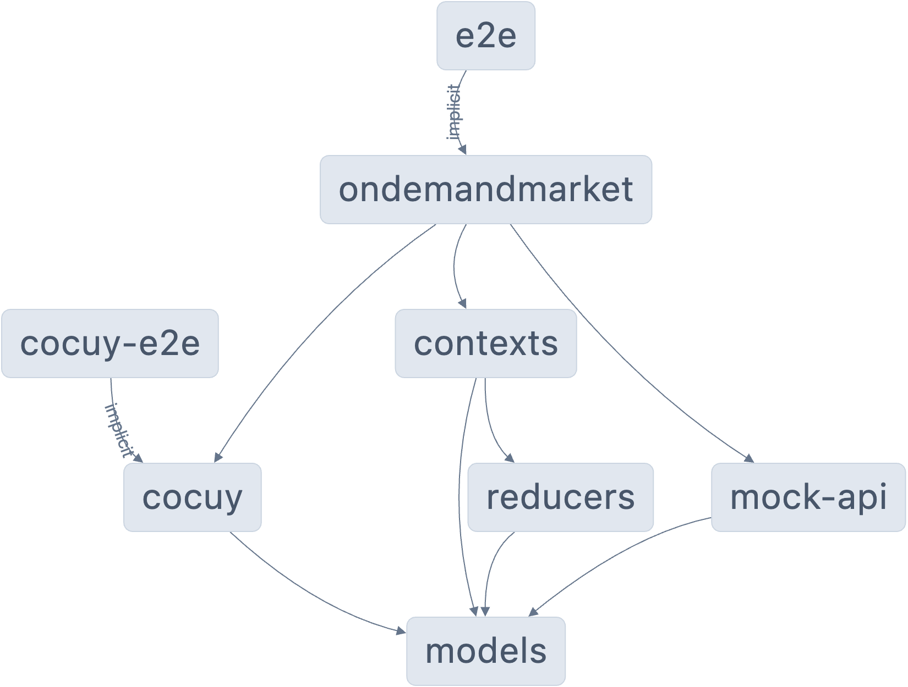

# On Demand Market

✨ **Este espacio de trabajo ha sido generado por [Nx, un sistema de construcción inteligente, rápido y extensible.](https://nx.dev)** ✨

On Demand Market es una plataforma que conecta a clientes con trabajadores capacitados para realizar diversas tareas. La plataforma está construida utilizando React.

## Características de la plataforma

La plataforma consta de dos roles principales:

1. **Cliente**: Los usuarios que proponen tareas que requieren.
2. **Doer (Colaborador)**: Los usuarios que realizan estas tareas.

Los Doers deben ingresar detalles como habilidades, precio estimado por habilidad y distancia máxima a la que se desplazarían para hacer un trabajo.

## Instrucciones de la plataforma

- Los usuarios pueden registrarse y declarar su rol como "Cliente" o "Doer".
- Los clientes proponen una tarea que contiene palabras clave basadas en taxonomía que especifican la jerarquía de los tipos de trabajo requeridos.
- El sistema propone un precio para la tarea (promedio), pero el cliente puede cambiar este valor.
- El sistema determina los colaboradores con habilidades que puedan desempeñar la tarea y con calendario abierto para la fecha y hora propuesta en la tarea.
- El cliente puede seleccionar uno o varios colaboradores potenciales.
- El colaborador es notificado y puede aceptar/rechazar/proponer cambio de tarifa.
- Cuando la tarea es finalizada por el colaborador, ambas partes se califican entre sí con un puntaje y un mensaje.
- El pago es realizado y las notificaciones de tarea finalizada son mostradas al cliente y al colaborador.

## Servidor de desarrollo

Ejecuta `nx serve ondemandmarket` para un servidor de desarrollo. Navega a http://localhost:4200/. La aplicación se recargará automáticamente si cambias alguno de los archivos fuente.

## Storybook

Storybook es una herramienta de desarrollo de UI que nos permite visualizar y probar los componentes de nuestra aplicación de manera aislada. Para iniciar Storybook, ejecuta `nx run ondemandmarket:storybook`.
[https://64a96bda96f7186ced6e08c9-gxujxlyrgm.chromatic.com/](https://64a96bda96f7186ced6e08c9-gxujxlyrgm.chromatic.com/)

## Integración Continua con GitHub Actions

Este proyecto utiliza GitHub Actions como su herramienta de integración continua. Hay dos flujos de trabajo principales configurados en el repositorio:

1. **chromatic.yml**: Este flujo de trabajo se encarga de la integración con Chromatic, una plataforma para la revisión visual de componentes. Se ejecuta en cada push a la rama principal.

2. **deploy.yml**: Este flujo de trabajo se encarga del despliegue de la aplicación. Se ejecuta en cada push a la rama principal y después de que el flujo de trabajo de Chromatic haya terminado con éxito.

Puedes encontrar más detalles sobre estos flujos de trabajo en el directorio `.github/workflows` del repositorio.

## Entender este espacio de trabajo

Ejecuta `nx graph` para ver un diagrama de las dependencias de los proyectos.

## Ayuda adicional

Visita la [Documentación de Nx](https://nx.dev) para aprender más.

## Configuración del proyecto

Este proyecto fue iniciado con Nx y usa React para la UI. Los estilos están escritos en SCSS. El proyecto está configurado para usar la API Mock para obtener datos. El proyecto también la configuración de pruebas unitarias con Vitest y Testing Library.

## Monorepo

El proyecto utiliza una estructura de monorepo gestionada por Nx. Esto permite una fácil gestión de los diferentes módulos del proyecto, cada uno responsable de una característica específica de la aplicación. Los principales módulos son:

- `@cocodemy/cocuy`: Este módulo contiene el sistema de diseño de la aplicación. Esto asegura que la aplicación no dependa de un framework específico para actualizar su estilo y diseño, lo que facilita el mantenimiento y la escalabilidad.
- `@cocodemy/contexts`: Este módulo actúa como puente entre la lógica de negocio y los componentes gráficos de la aplicación. Esto permite separar las responsabilidades de cada módulo, facilitando el mantenimiento y la escalabilidad del producto.
- `@cocodemy/mock-api`: Este módulo se utiliza para simular un backend. Responde a las peticiones de GraphQL y gestiona la información que se ingresa en la aplicación. Esto permite un desarrollo y pruebas más eficientes al no depender de un backend real.
- `@cocodemy/models`: Este módulo contiene las interfaces y tipos de la aplicación, siguiendo las recomendaciones de una arquitectura limpia. Esto asegura que todos los componentes de la aplicación sigan una estructura de datos coherente y predecible.
- `@cocodemy/reducers`: Este módulo contiene gran parte de la lógica de la aplicación, encargado de modificar el almacenamiento y realizar llamadas a las APIs de la aplicación. Esto permite una gestión centralizada del estado de la aplicación, facilitando el seguimiento y la actualización del estado.

## Despliegue

La aplicación ha sido desplegada en GitHub Pages y se puede acceder en la siguiente URL: [https://oscm91.github.io/ondemandmarket](https://oscm91.github.io/ondemandmarket)

## Resportes

Se realiza analisis de rendimiento con lighthouse [https://pagespeed.web.dev/analysis/https-oscm91-github-io-ondemandmarket/tszak2byb1?form_factor=desktop](https://pagespeed.web.dev/analysis/https-oscm91-github-io-ondemandmarket/tszak2byb1?form_factor=desktop) y Mobile-Friendly Test [https://search.google.com/test/mobile-friendly/result?id=3XP5uNW8cseyVffFs1hNlQ](https://search.google.com/test/mobile-friendly/result?id=3XP5uNW8cseyVffFs1hNlQ)